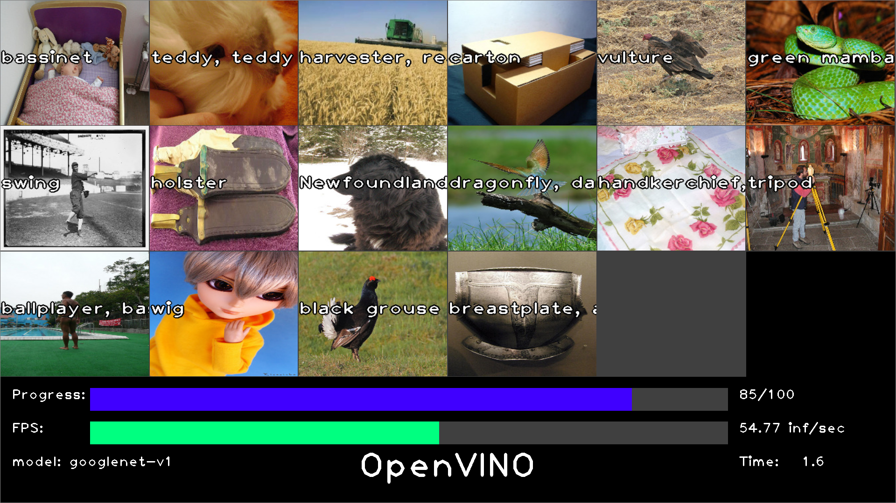

# OpenVINO Visual Performance Demo Program

## Overview
This is an OpenVINO performance demo program. This program shows inferencing performance visually on the screen so that the audience can get the performance of the system and OpenVINO intuitively.  
The proram supports simple image classification models and SSD type of object detection models.  

## Prerequisites
- OpenVINO 2020.4
- Some Python modules  
` pip install pyyaml,numpy,opencv-python`
- Image files for inferencing  
  - Annotation file is not required.
  - Place image files in a directory and specify the directory in the YAML configration file.
- Image classification IR model such as ResNet-50

## Configuration
Benchmark configuration can be defined in a YAML file. Create your own configuration by reffering to the `default.yml` as an example.  
**Note:** Inference result will be updated (displayed) every `display_skip_count` times the inference is performed. You can use lower value for `display_skip_count` to increase the screen update rate but it will consume much CPU power and may have negative impact to the inference performance.  

## How to run
1. Create or modify YAML configuration file
 - The YAML configuration file contains the parameters for performance demo
 - `default.yml` will be used when no configuration file is given.
2. Run the performance demo script  
`python visual-demo.py -c <config.yml>`

## Tested environment
- OpenVINO 2020.4
- Windows 10
- Ubuntu 18.04

## Update history
 - 2020-07-10: Separated benchmark main loop to a thread. Screen update and control logic is still remain in the main thread. This minimizes the performance impact from screen update.

